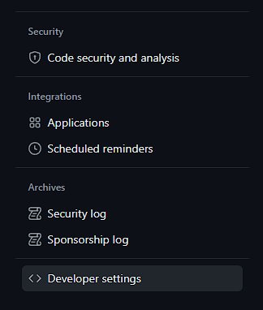

 


# Portfolio Dinâmico


Esse Projeto consiste em prover um portfolio dinâmico que se adapta ao perfil do github dos desenvolvedores, exibindo os projetos pinados no github do usuário e as informações no perfil do mesmo. O objetivo desse projeto é fazer com que desenvolvedores possam ter de maneira rápida e pratica um portfolio para apresentação, divulgação e/ou para colocar em formulários de vagas.

## Quais informações serão exibidas?

Os projetos que serão exibidos pelo portfolio serão os projetos que você selecionar como "pinados" na sua pagina inicial do github.


E as informações como seu nome e o "sobre você" serão retirados do seu perfil do github.


## Como configurar?

Para configurar o projeto, basta configurar as variaveis de ambiente corretamente, com as variaveis de ambiente será possivel, colocar o token de acesso a api do github, selecionar o perfil que deseja exibir e o estilo do portfolio. Atualmente as variáveis de ambiente são:

```env
GQL_TOKEN=
USER=
STYLE=
REPEAT=false
BG=0
```

A seguir vou detalhar como preenher cara um dos itens das variáveis de ambiente.


## Token da api do github

O primeiro passo que deve ser levado em consideração para que esse projeto se adapte ao seu perfil é gerar o token de consumo da api graphQL do github. Para fazer isso acesse o seu perfil do github e selecione as configurações.


Selecione as configurações dos desenvolvedores.



Selecione a opção de token classico nos seus tokens pessoais de acesso.


Selecione a opção para criar um novo token classico.


Agora siga as seguintes configurações para que o token permita o projeto acessar as informações necessárias do seu perfil, é recomendado que deixe o token sem tempo de expiração para que seu portfolio não saia do ar porque o token expirou. É importante ressaltar que o projeto só requer permissão para leitura de informações e no momento só requer permissão de leitura dos projetos, repositorios e das informações do usuário, mas já recomendei outras informações que seriam interessantes, para que em futuras atualizações não seja necessário criar um novo token. 


Após preencher essas opções crie o token e o adicione como variavel de ambiente de seu projeto no campo GQL_TOKEN.

```env
GQL_TOKEN=seutoken
```


## Perfil

O projeto consome apenas as informações publicas dos usuários do github então ele pode exibir os projetos e as informações do perfil de qualquer usuário, para configurar o projeto para exibir suas informações e projetos basta adicionar o seu username na variável USER, você pode encontrar o username facilmente na url do seu perfil, ou abaixo do seu nome na sua pagina.


Com isso suas variáveis de ambiente devem conter as seguintes informações até o momento:

```env
GQL_TOKEN=seu_token
USER=username_github
```

## Estilo

Por fim para que o portfolio tenha um pouco mais de personalidade deixei preparado alguns estilos e é na variavel de ambiente STYLE que você definirá qual estilo quer que seu portfófio apresente.

#### Estilo Flat

A variável de ambiente deve ficar assim: 
```env
STYLE=flat
```
O design do portfolio ficará desse jeito:


#### Estilo Menphis

A variável de ambiente deve ficar assim: 
```env
STYLE=vintageInternet
```
O design do portfolio ficará desse jeito:


#### Estilo Colagem

A variável de ambiente deve ficar assim: 
```env
STYLE=collage
```
O design do portfolio ficará desse jeito:


#### Estilo Punk

A variável de ambiente deve ficar assim: 
```env
STYLE=punk
```
O design do portfolio ficará desse jeito:


## Configurando meu repositório

Por padrão seus projetos podem não aparecer de maneira ideal, um projeto sem a configuração correta pode aparecer assim no seu portfolio:


Então para que o projeto seja exibido corretamente só são necessárias algumas alterações no repositório

#### Descrição

Para alterar a descrição do projeto você deve ir nas configurações do "sobre" do seu repositorio e preencher o campo descrição curta


Agora o projeto vai apresentar essa descrição em seu card


#### Link do site publicado

Na mesma area de configuração da descrição coloque a url do site publicado ou caso esteja publicado no github pages selecione a opção "usar github pages", para que quando alguem clique na imagem do projeto seja redirecionado para o site publicado.


#### Imagem do seu projeto

Por fim a miniatura do projeto se baseia na imagem que o github associa ao seu repositório quando você compartilha o link do mesmo. Por padrão a imagem apresenta seu perfil do github, o nome do repositório e algumas informações do repositório, mas essa imagem pode ser alterada.

Para alterar a imagem de exibição vá até as configurações do repositório, e nas opções de previa social faça o upload da imagem que deseja exibir no portfolio, recomendo que seja uma print do projeto, mas se desejar colocar uma imagem mais simbolica como o icone do projeto ou a logo do mesmo, também pode ficar interessante.


E pronto! Seu projeto esta configurado corretamente para o portfolio.

